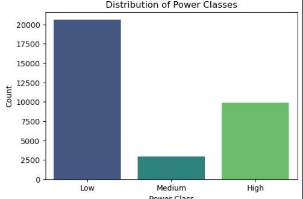
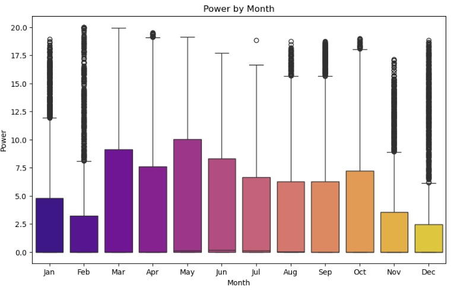
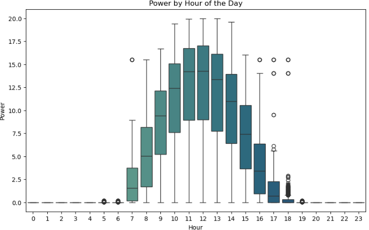
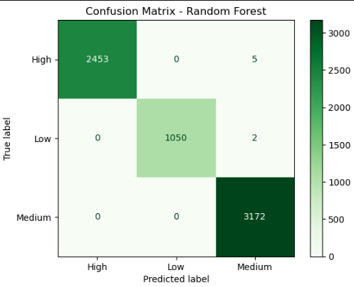
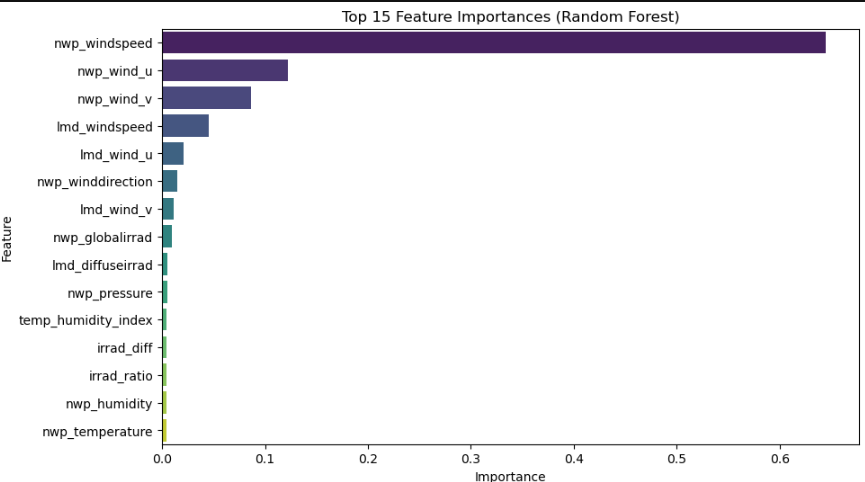

# Predicting Photovoltaic Energy Production Performance
[](https://github.com/tolly00/capstone-project/blob/main/LICENSE)
[](https://github.com/tolly00/capstone-project/commits/main)
[](https://www.python.org/)
[](https://www.linkedin.com/in/albertosylveus/)
[](https://www.linkedin.com/in/marcus-inossaint/)
[](https://www.linkedin.com/company/myakademico)
# Overview
The goal of this Data Science project is to **develop a predictive model** capable of estimating PV energy production with high accuracy. By doing so, the organization will improve resource allocation, maintenance scheduling, and power delivery reliability.

# Business Understanding
#### **Stakeholders:**  
The project benefits multiple groups including renewable energy companies seeking to improve photovoltaic efficiency, government institutions(**like EDH**) involved in energy policy, local communities(**business owner, residents,...**) aiming to access stable and clean electricity and Data Science Team responsible for data collection, analysis, model development, and system integration. The academic team is also a key stakeholder responsible for research, model development, and interpretability analysis.
    
#### **Business Problem**

The organization currently faces challenges in accurately predicting solar energy production due to fluctuating environmental conditions such as solar irradiance, temperature, humidity, and wind speed.  
This uncertainty can lead to **inefficient energy distribution**, **overreliance on backup systems**, and **financial losses**.

#### **In-Scope Problems**

-   Collecting, cleaning, and preparing environmental and production datasets.
    
-   Building and evaluating machine learning models (Logistic Regression, Random Forest).
    
-   Performing feature engineering to identify variables that strongly influence energy production.
    
-   Delivering visual analytics and model performance reports to support decision-making.

The dataset includes environmental and operational parameters. Using a large dataset of solar production records, the study applies machine learning techniques to uncover patterns between meteorological conditions such as irradiance, temperature, and wind and PV energy performance.

  
# Data Understanding
#### **Provenance**
The dataset used for this project is publicly available on the [SciDB platform](https://www.scidb.cn/en/detail?dataSetId=f8f3d7af144f441795c5781497e56b62) , maintained by the SciDB repository, a trusted scientific data-sharing platform. It was collected **by Tiechui Yao, Jue Wang, Haoyan Wu, et al. (2021).** 
The data integrates both **Numerical Weather Prediction (NWP)** parameters and **Local Meteorological Data (LMD)**, allowing the development of models that correlate environmental conditions with solar energy output. It covers over a year of solar power production from **ten solar stations**, totaling more than **270,000 records** and contains seven key features: **global irradiance, diffuse irradiance, temperature, pressure, wind direction, wind speed, and photovoltaic output.**

#### **Local Context**
While the dataset does not originate from **Haiti** or any specific local station, it reflects meteorological and operational conditions similar to those found at comparable latitudes and climates.  
Photovoltaic (PV) production behavior primarily depends on universal environmental factors such as irradiance, temperature, and humidity. This makes external datasets suitable for model training and proof-of-concept purposes. The objective is not to model a specific local site, but to establish a general predictive framework that can later be fine-tuned using Haitian or Caribbean data when available.

To ensure contextual relevance, the interpretation phase will:

-   Focus on transferable variables (irradiance, humidity, wind) rather than geographically fixed ones.
    
-   Draw local insights by analogy, relating similar conditions such as cloud coverage during the rainy season or coastal humidity to their effects on PV output.
    
-   Provide a scalable modeling pipeline capable of integrating future local datasets for retraining or domain adaptation.
    

This work establishes the methodological foundation data preprocessing, temporal modeling, and interpretability analysis while recognizing that local calibration will be an essential next step for real world deployment in Haiti or other comparable regions.

# visualization





# Modeling
This project formulates a **classification problem**, aiming to predict the **energy production level** (_Low_, _Medium_, or _High_) from environmental and meteorological variables.  
The target variable `power_class` was derived from the continuous feature `power` by applying thresholds to categorize the output levels.

To identify the most effective classifier, several algorithms were tested and compared:

-   **Logistic Regression**
-   **Random Forest Classifier**

To ensure the model generalizes well to unseen data, we made **feature selection and correlation analysis.** Model performance was evaluated using the classification metrics: **Accuracy, precision, Recall, F1-Score and Confusion matrix.**

# Evaluation and interpretation
After training multiple classification models, we evaluated their performance on unseen test data to identify the best-performing algorithm for predicting solar energy production levels (Low, Medium, High).

| **Model** | **Accuracy** | **Precision** | **Recall** | **F1-Score** | 
|:-----------|:-------------:|:--------------:|:------------:|:--------------:|
| Logistic Regression | 0.9649 | 0.93 |0.92  | 0.92 | 
| **Random Forest Classifier** | **0.9609** | **0.92** | **0.92** | **0.92** | 





#### Interpretation Summary

The final classification model provides a practical way to forecast energy production categories using accessible environmental inputs.
It transforms complex meteorological data into clear insights for decision-making helping system operators or individual users (like house owners) anticipate solar energy availability and optimize usage.

# Technologies
The project leverages a modern data science technology stack to ensure efficient data processing, model training, and evaluation.

- **Programming language:** Python 3.12.7
- **Data manipulation and analysis:** Pandas, NumPy.
- **Data vizualisation:** Matplotlib, seaborn.
- **Machine learning and modeling:** Scikit-learn
- **Development environment:** Jupyter notebook, VS Code.
- **Version control:** Git & Github

# Repository structure
```bash
capstone-project/
├── Data/          # dataset for the case study
│   ├── ...
│   ├── ...
│   └── ...
├── Images/        # images used
│   ├── ...
│   ├── ...
│   └── ...
├── PDFs/          # pdf files 
│   ├── ...       # notebook.pdf
│   ├── ...       # github.pdf
│   └── ...       # presentation.pdf
├── .DS_Store       
├── .gitignore
├── LICENSE
├── Multi-station_Trained_Model.ipynb
├── README.md    
└── Single-station_Trained_Model.ipynb           
```
